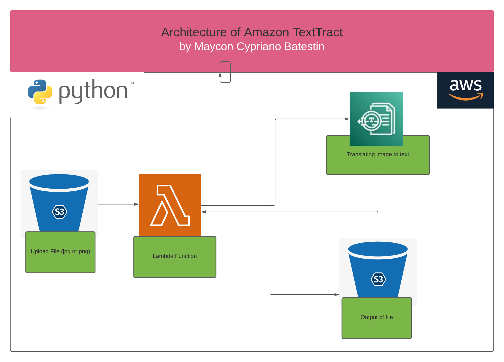
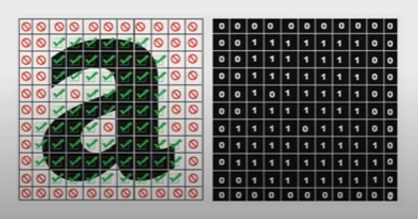

<h1 align="center">

<h3> 
AMAZON TEXTRACT  
 </h3>
<h3> 
 ================= 
 </h3>

>> Arquitetura da solução:

>> <h3> Description </h3>
-------------------------

 
Amazon Textract is a managed machine learning service that automatically extracts text and structured data from virtually any document. Customers use Amazon Textract to rapidly automate document workflows, processing millions of pages of documents in hours.
In this project. We transform two images into text. The first is the golden law, signed by Princess Isabel and the second is a letter from Einstein about the atomic bomb. Both images are in the national museum. For this transformation, we use a lambda function that is activated the moment files are placed in an S3 bucket. It reads the png file and transforms it into a txt for editable comprehension.

>> <h3> How OCR works </h3>
-------------------------

 OCR works by dividing the image of a text character into sections and distinguishing them between empty and non-empty regions.

